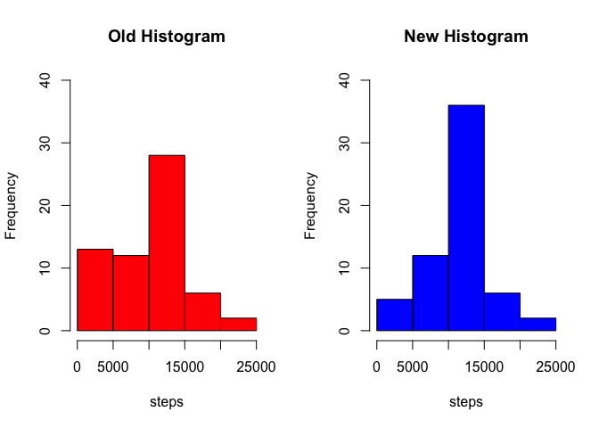

# Reproducible Research: Peer Assessment 1


## Loading and preprocessing the data

```r
library(data.table)
data <- fread("unzip -cq activity.zip")
data[,date:=as.Date(date)]
```
Converted the date column to Date data type


## What is mean total number of steps taken per day?
Calculate the total number of steps per day

```r
stepsperday <- data[, .(steps=sum(steps, na.rm=TRUE)), by=date]
```

Make a histogram of the total number of steps taken each day

```r
with(stepsperday, hist(steps))
```

<!-- -->

Calculate and report the mean and median of the total number of steps taken per day

```r
summary(stepsperday$steps)[c("Mean", "Median")]
```

```
##     Mean   Median 
##  9354.23 10395.00
```


## What is the average daily activity pattern?
Find the number of steps taken during intervals averaged across all days

```r
stepsperinterval <- data[, .(steps=mean(steps, na.rm=TRUE)), by=interval]
```

Make a time series plot of the 5-minute interval and the average number of steps taken

```r
with(stepsperinterval, plot(interval, steps, type="l"))
```

<!-- -->

Which 5-minute interval contains the maximum number of steps?

```r
stepsperinterval[which.max(steps),interval]
```

```
## [1] 835
```


## Imputing missing values
Calculate and report the total number of missing values in the dataset

```r
missingsteps <- data[, .I[is.na(steps)]]
length(missingsteps)
```

```
## [1] 2304
```

Impute missing values in the dataset with the average for that interval  
The average is truncated to an integer

```r
imputedsteps <- sapply(data[missingsteps,interval], function(i) {
  as.integer(stepsperinterval[interval==i,steps])
})
```

Create a new dataset that is equal to the original dataset but with the missing
data filled in

```r
newdata <- copy(data)
newdata[missingsteps, steps:=imputedsteps]
```

Make a histogram of the total number of steps taken each day  and report the
new mean and median.

```r
newstepsperday <- newdata[, .(steps=sum(steps)), by=date]
par(mfcol=c(1,2))
with(stepsperday, hist(steps, main="Old Histogram", col="Red", ylim=c(0,40)))
with(newstepsperday, hist(steps, main="New Histogram", col="Blue", ylim=c(0,40)))
```

<!-- -->

```r
summary(newstepsperday$steps)[c("Mean", "Median")]
```

```
##     Mean   Median 
## 10749.77 10641.00
```


## Are there differences in activity patterns between weekdays and weekends?
Create a new factor variable indicating whether a given date is a weekday or weekend

```r
weekdayweekend <- ifelse(
  weekdays(newdata$date) %in% c("Saturday", "Sunday"),
  "Weekend", "Weekday"
)
newdata[,weekday:=as.factor(weekdayweekend)]
```
Make a time series plot of the interval and the number of steps taken during
weekdays and weekends

```r
newstepsperinterval <- newdata[, .(steps=mean(steps)), by=.(interval, weekday)]
library(lattice)
xyplot(
  steps~interval | weekday,
  data=newstepsperinterval,
  type="l",
  layout=c(1,2)
)
```

<!-- -->
